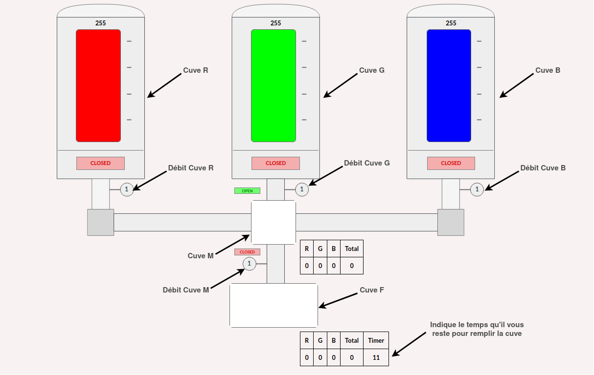

# Color Plant

Une usine de production de liquides colorés (s'appuyant sur le système de codage [RGB](https://fr.wikipedia.org/wiki/Rouge_vert_bleu)) est contrôlée par un automate qui dialogue avec un serveur SCADA via le protocole Modbus. Le protocole Modbus permet de lire et écrire dans certains registres de l'automate.

Ces serveurs sont accessibles à ces adresses :
* automate : `nc localhost 4502`
* interface web SCADA de l'usine : https://localhost:8000/.

Cette usine est conçue pour produire une solution chimique de couleur bien spécifique.
Pour cela, elle est constituée de 5 cuves, 5 vannes et 4 régulateurs de débit :
- Une cuve (nommée cuve `R`) contenant 255 unités de couleur rouge dont l'ouverture est controlée par une vanne.
- Une cuve (nommée cuve `G`) contenant 255 unités de couleur verte dont l'ouverture est controlée par une vanne.
- Une cuve (nommée cuve `B`) contenant 255 unités de couleur bleu dont l'ouverture est controlée par une vanne.
- Une cuve (nommée cuve `M`) contenant un mix de couleur (mais initialement vide) d'une capacité de 100 unités dont l'ouverture par le haut ou les côtés est controlée par une vanne et l'ouverture par le bas est controlée par une autre vanne.
- Une cuve (nommée cuve `F`) contenant un mix de couleur final (initialement vide) d'une contenance de 200 unités (cuve `F`).
- Un régulateur de débit pour chaque cuve `R`, `G` et `B` qui contrôle le nombre d'unités de liquide qui s'écoule par seconde lorsque la vanne de la cuve respective est en position ouverte.
- Un régulateur de débit pour la cuve `M` qui contrôle le nombre d'unités de liquide R, G et B qui vont s'écouler par seconde dans la cuve `F` lorsque que la vanne basse de la cuve `M` est ouverte.

**Important.**
La couleur des cuves suit le système de coloration RGB. Il peut paraître surprenant que le mix d'une seule unité verte et d'une seule unité rouge ne donne pas la couleur attendue (jaune) car en effet dans ce système de codage, la couleur `RGB(1,1,0)` donne une couleur noire mais ceci n'a aucune incidence sur la résolution des épreuves.

 

 

L'usine `Color Plant` est contrôlée par un automate dont la liste des registres modbus est donnée ci-dessous :

| Type                |&nbsp;&nbsp; | Indice |&nbsp;&nbsp;| Fonction                                        |&nbsp;&nbsp;| Droits              |
| :------------------ |-------------| :----- |------------|:----------------------------------------------- |------------| :------------------ |
| Coil                |             |  0     |            | Ouverture vanne cuve `R`                        |            | lecture / écriture  |
| Coil                |             |  1     |            | Ouverture vanne cuve `G`                        |            | lecture / écriture  |
| Coil                |             |  2     |            | Ouverture vanne cuve `B`                        |            | lecture / écriture  |
| Coil                |             |  3     |            | Ouverture vanne cuve mix basse                  |            | lecture / écriture  |
| Holding Register    |             |  0-31  |            | Token du joueur                                 |            | lecture             |
| Holding Register    |             |  32    |            | Régulation du débit cuve `R`                    |            | lecture / écriture  |
| Holding Register    |             |  33    |            | Régulation du débit cuve `G`                    |            | lecture / écriture  |
| Holding Register    |             |  34    |            | Régulation du débit cuve `B`                    |            | lecture / écriture  |
| Holding Register    |             |  35    |            | Régulation du débit cuve `M`                    |            | lecture / écriture  |
| Input Register      |             |  0     |            | Nombre d'unités rouge dans la cuve `R`          |            | lecture             |
| Input Register      |             |  1     |            | Nombre d'unités verte dans la cuve `G`          |            | lecture             |
| Input Register      |             |  2     |            | Nombre d'unités bleu dans la cuve `B`           |            | lecture             |
| Input Register      |             |  3     |            | Nombre d'unités rouge dans la cuve `M`          |            | lecture             |
| Input Register      |             |  4     |            | Nombre d'unités verte dans la cuve `M`          |            | lecture             |
| Input Register      |             |  5     |            | Nombre d'unités bleu dans la cuve `M`           |            | lecture             |
| Input Register      |             |  6     |            | Nombre total d'unités R, G ou B dans la cuve `M`|            | lecture             |
| Input Register      |             |  7     |            | Nombre d'unités rouge dans la cuve `F`          |            | lecture             |
| Input Register      |             |  8     |            | Nombre d'unités verte dans la cuve `F`          |            | lecture             |
| Input Register      |             |  9     |            | Nombre d'unités bleu dans la cuve `F`           |            | lecture             |
| Input Register      |             |  10    |            | Nombre total d'unités R, G ou B dans la cuve `F`|            | lecture             |
| Discret Input       |             |  0     |            | Ouverture vanne cuve mix haute                  |            | lecture             |

 

De plus, un automate de "safety" est en charge de contrôler que le procédé industriel ne mette pas en danger le bon fonctionnement de l'usine. Pour cela, celui-ci :
-   Ferme automatiquement les vannes des cuves `R`, `G` et `B` si la cuve mix est pleine.
-   Ferme automatiquement la vanne haute de la cuve mix si la cuve mix est pleine.
-   Ferme automatiquement la vanne basse de la cuve mix si la vanne haute de cette même cuve est ouverte.
-   Ouvre automatiquement la vanne haute de la cuve mix si la cuve mix est vide.

Dès que l'automate effectue une action automatique (par exemple fermer une vanne), une alarme est envoyée et sera visible sur l'interface web SCADA.

En donnant des consignes à l'automate (ajustement des débits, ouverture/fermeture des cuves, etc.) via la lecture ou l'écriture dans ses registres Modbus, vos objectifs sont de :
1. Récupérer votre token permettant d'accèder à l'interface web SCADA.
2. Remplir la totalité de la cuve `F` avec la couleur `RGB(32,126,42)`, et ce, en moins de **90 secondes**.

Chaque nouvelle connexion TCP à l'automate sur le port 502 implique la réinitialisation de l'automate Modbus, ainsi, un nouveau token est généré à chaque nouvelle connexion.

**Important.**
Pour compléter les deux étapes de ce challenge dans le temps imparti, vous ne devrez donc pas couper votre connexion TCP et effectuer toutes vos requêtes Modbus dans _la même_ connexion TCP.

Pour résoudre ces épreuves, les ressources ci-dessous pourront vous être utile :

* [Modbus Specifications](https://www.modbus.org/docs/Modbus_Application_Protocol_V1_1b3.pdf)
* [Modbus Layer Scapy](https://scapy.readthedocs.io/en/latest/api/scapy.contrib.modbus.html)
* [PyModbusTCP](https://pypi.org/project/pyModbusTCP/)
